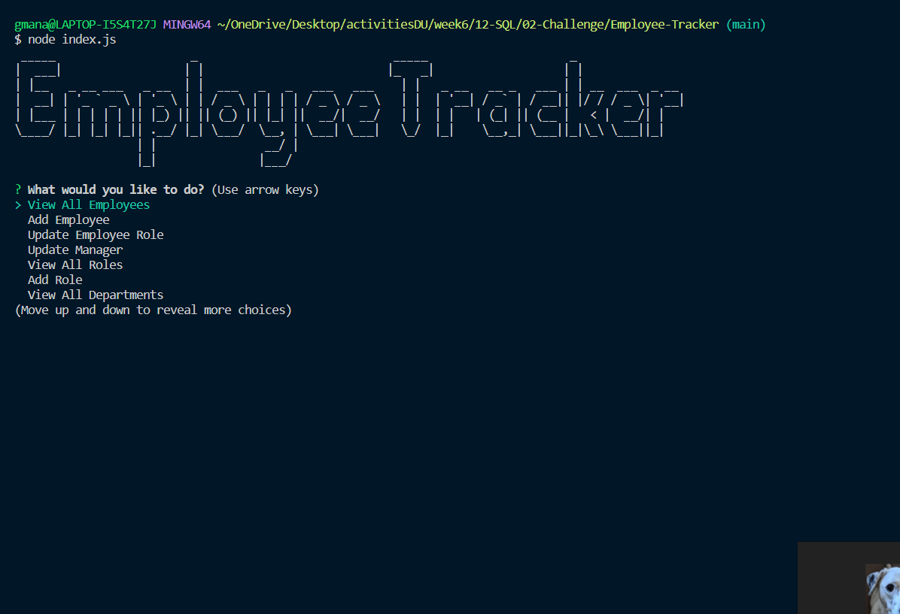

# Employee-Tracker

## Table of Contents:

- [Description](#description)

- [Installation](#installation)

- [Usage](#usage)

- [Credits](#credits)

- [Tests](#tests)

- [Contact](#contact)

- [Video Walkthrough](#video-walkthrough)

## Description

User story:

AS A business owner
I WANT to be able to view and manage the departments, roles, and employees in my company
SO THAT I can organize and plan my business

## Installation

npm i, initialize database and seeds with workbench, node index.js

## Usage

Run node index.js, then follow the prompts onscreen.

## Credits

N/A

## Tests

N/A

## Contact

Contact me at my

- Github: https://github.com/GarrettA01

- Email: gman.anderson2001@gmail.com

for questions!

## Video Walkthrough

https://drive.google.com/file/d/1RqimNLlZI_V3VCk79dbAE4T977Pbz7JQ/view?usp=sharing
